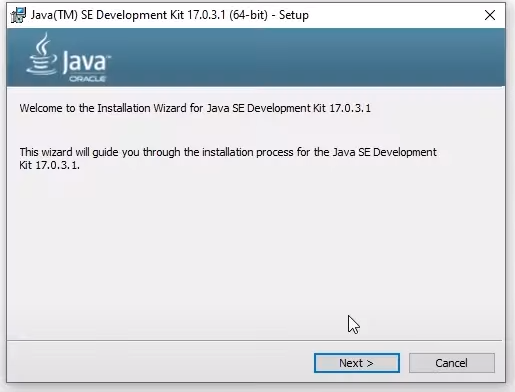
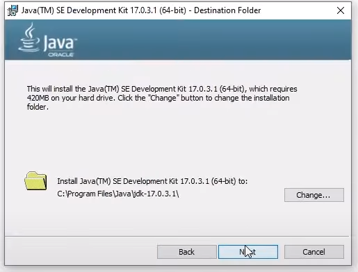
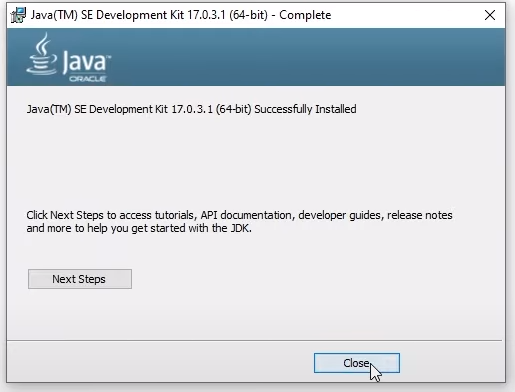
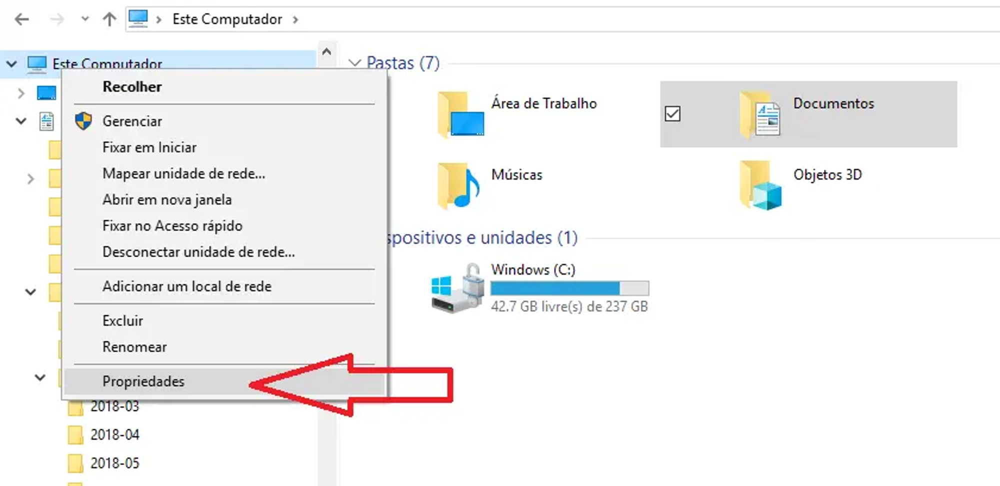
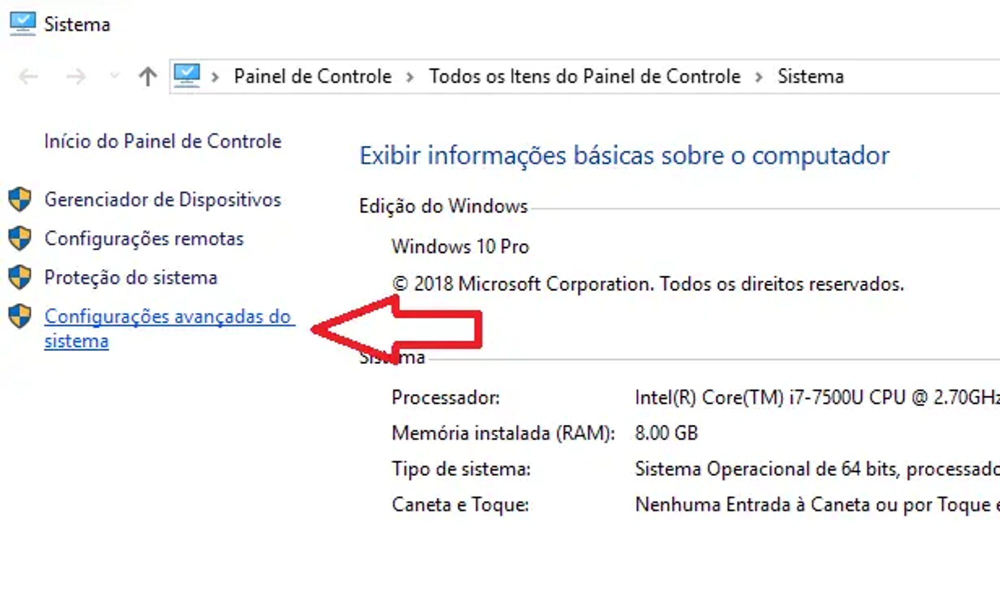
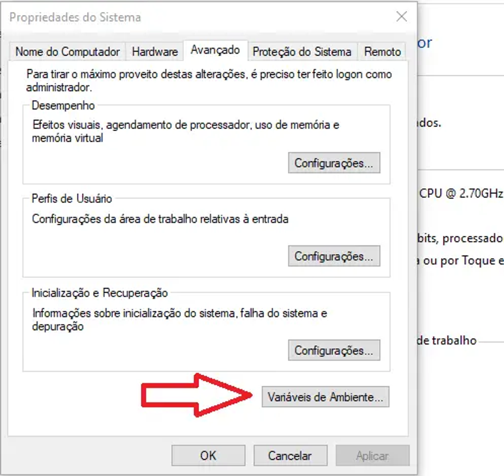
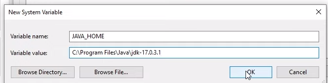
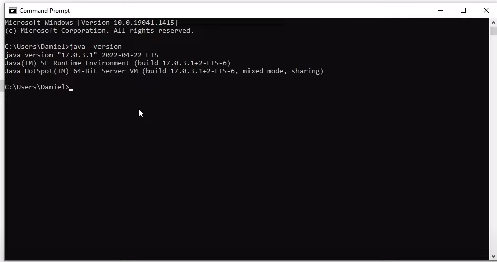

<h1>
    <a href="https://github.com/elizabetefabri">
     </a>
    <span>JAVA e JDK</span>
</h1>

## 1. Windows - Passo a Passo
- [Windows: download JAVA - JDK17](https://download.oracle.com/java/17/archive/jdk-17.0.6_windows-x64_bin.msi)
- [Windows: download JAVA - JDK21](https://download.oracle.com/java/21/latest/jdk-21_windows-x64_bin.msi)

## 2. Clicar no arquivo baixado
### 2.1 Clicar em next


### 2.2 Clicar em next para inserir o Java na pasta default


### 2.3 Clicar em yes  e depois em close


### 2.4 Acessar o diretório C:\Arquivo de Programas\Java\jdk-17.0.3.1 e verificar se a pasta está instalada corretamente 


### 2.5 Clicar com o botão direito em Meu computador > Propriedades


### 2.6 Acessar Configurações avançadas de sistema


### 2.7 Acessar Variáveis de ambiente


### 2.8 Clicar em **new** para adicionar a variável de ambiente e colocar a seguinte instrução

- Nome da variável: JAVA_HOME

- Valor da variável: C:\Arquivo De Programas\jdk-17.0.3.1 

- Obs: O valor da variável deverá ser exatamente o caminho onde o Java foi instalado



### 3. Clicar em OK
#### 3.1 Acessar a variável Path e clicar em editar e depois em new
#### 3.2 Adicionar a variável do Java com a seguinte instrução e clicar em ok

``` %JAVA_HOME%\bin```


### 4. Acessar o terminal e digitar o comando java -version e verificar se a seguinte mensagem aparece.


## 1. Linux - Passo a Passo

- [Linux: download JAVA - JDK17](https://download.oracle.com/java/17/latest/jdk-17_linux-aarch64_bin.tar.gz)
- [Linux: download JAVA - JDK21](https://download.oracle.com/java/21/latest/jdk-21_linux-aarch64_bin.tar.gz)

## 2. Clicar no arquivo baixado
### 2.1 Abrir um terminal (CTRL + ALT + T)
### 2.2 Digitar o seguinte comando 
```
Digitar o seguinte comando 
```
Aceitar os termos, apertando ENTER

### 2.3 Atualizar o gerenciador de pacotes
```
sudo apt-get update 
```

### 2.4 Instalar o Java 
```
sudo apt-get install oracle-java17-installer --install-recommends
```

### 2.5 Pra ter certeza se o Java está instalado, digite java -version 
Se por acaso o Java não estiver sendo reconhecido no terminal, adicione o JAVA_HOME nas variáveis do seu bashrc 
```
export JAVA_HOME=/usr/lib/jvm/java-17-openjdk-amd64
```
