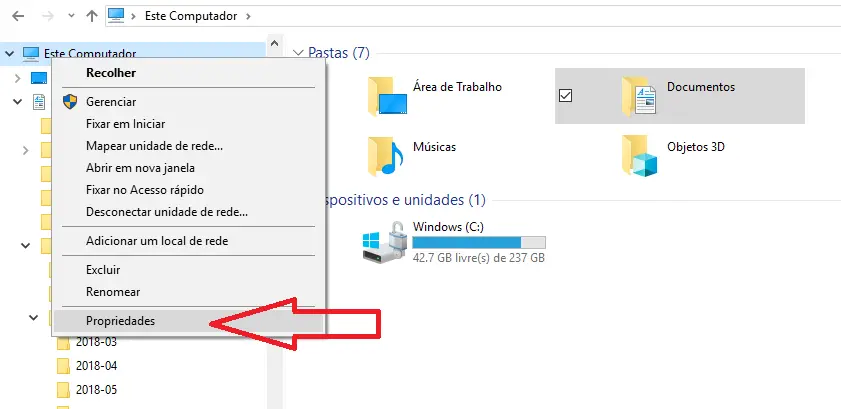
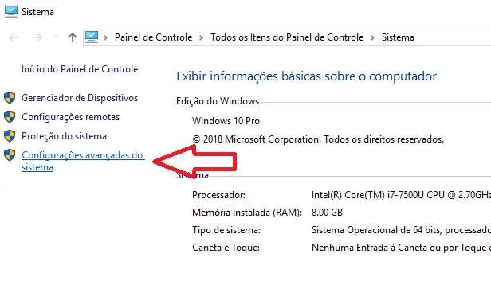
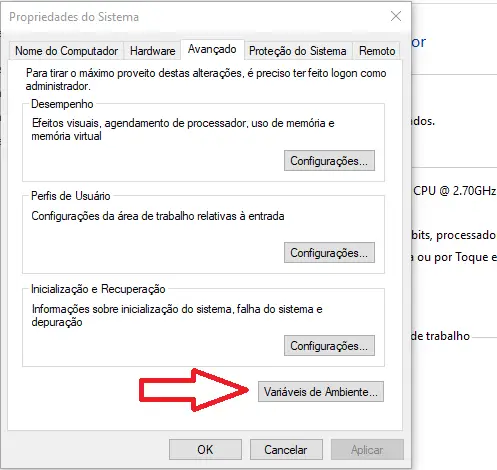
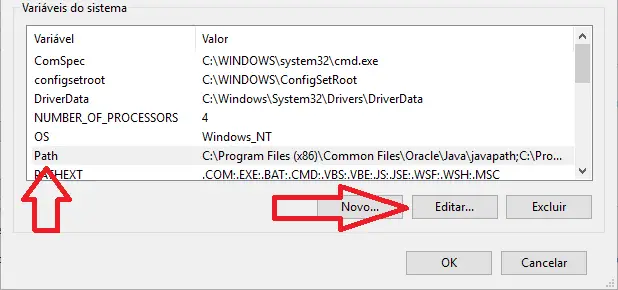
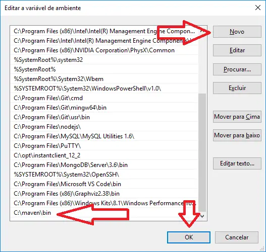
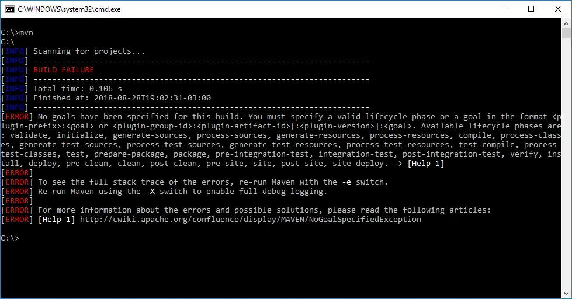

<h1>
    
    Maven
</h1>

## 1. Maven no Windows
- [Baixar o arquivo do Maven](https://dlcdn.apache.org/maven/maven-3/3.9.5/binaries/apache-maven-3.9.5-bin.zip)

## 2. Descompactar o arquivo baixado. 

**Atenção: No momento de descompactar o arquivo, é importante colocar em um local de fácil acesso. Uma dica é descompactar no C: , e renomear  a pasta para maven**

## 3. Após descompactar, acessar as variáveis de ambiente, clicando em **Este Compuador > Propriedades**

## 4. Clicar em Configurações avançadas do sistema

### 5. Na aba avançado clicar em Variáveis de ambiente

### 6. Selecione a variável Path e clique em Editar

### 7. Clique no botão novo e adicione o caminho da pasta bin do maven: C:\maven\bin  e clique em ok

### 8. Acesse o terminal e digite o comando mvn . O resultado esperado deverá ser o seguinte

## Maven no Linux

1-  Atualize os pacotes

`sudo apt-get update`

2 - Instale o maven com o seguinte comando

`sudo apt-get -y install maven`

O maven deverá ser instalado em um dos seguintes caminhos **/usr/share/maven**
 ou **/etc/maven**
.

Para verificar se o maven foi instalado com sucesso, acessar o terminar e digitar

`mvn -version`

Isso irá mostrar a versão do maven instalada.