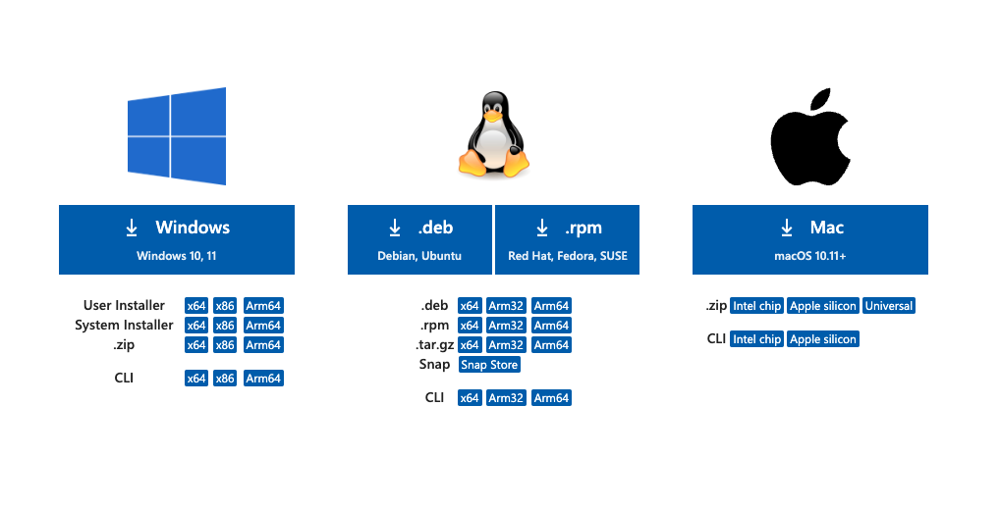
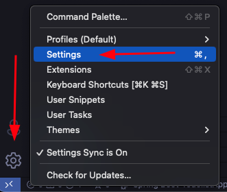
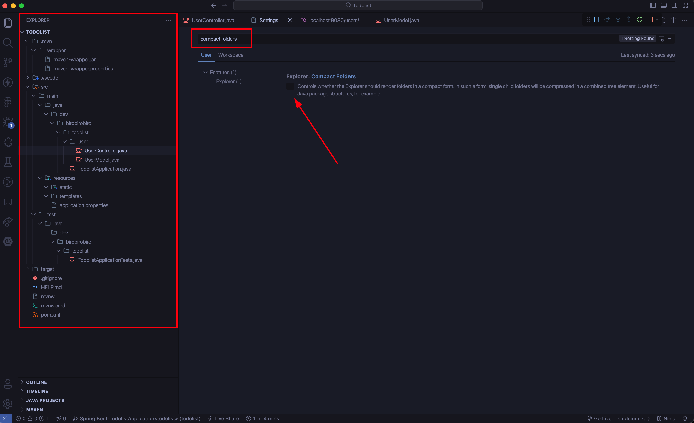

<h1>
    
    Instalar VSCode
</h1>

# VSCode

## 1. Instalação

A instalação do VSCode pode ser feita através do link abaixo:

[Site VSCode](https://code.visualstudio.com/Download)

Ao acessar o site, você deverá escolher para qual sistema operacional deseja realizar o download.

Ao baixar o arquivo, clique nele e siga todo o passo a passo. 

<aside>

💡 Caso já tenha o VS Code instalado, garanta que ele está `atualizado`

</aside>

## 2. Configuração Java no VS Code

Para utilizar o Java no VSCode, é necessário instalar as extensões abaixo

- **vscjava.vscode-java-pack**
    - vscjava.vscode-java-debug
    - vscjava.vscode-java-test
    - vscjava.vscode-java-dependency
    - vscjava.vscode-maven
    - redhat.java
- **vscjava.vscode-spring-initializr**
- **vmware.vscode-spring-boot**
- **vscjava.vscode-spring-boot-dashboard**

## 3. Recomendação

Recomendamos que você deixe a opção `compact folders` do VS Code `desmarcada`

### 3.1 Clique na engrenagem e depois em Settings

### 3.2 Na barra de pesquisa, pesquise por compact folders e Desmarque essa opção, dessa forma o explorador de arquivos ficará no modelo de árvore e você terá uma melhor visualização das pastas do projeto.

